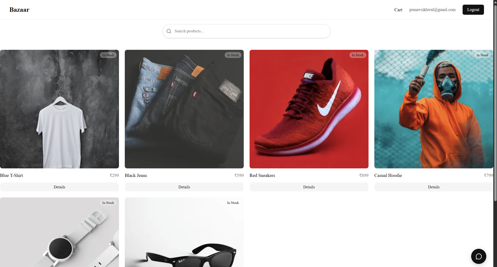
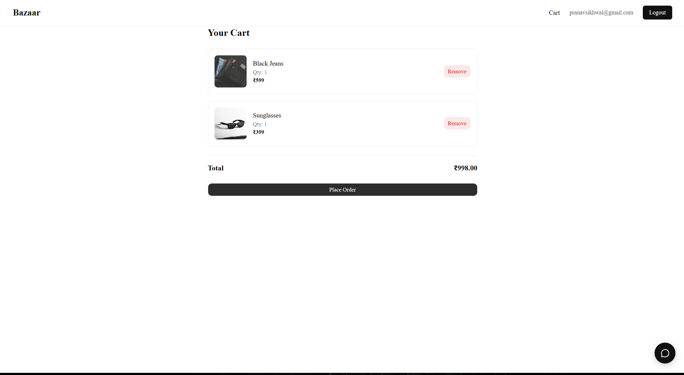
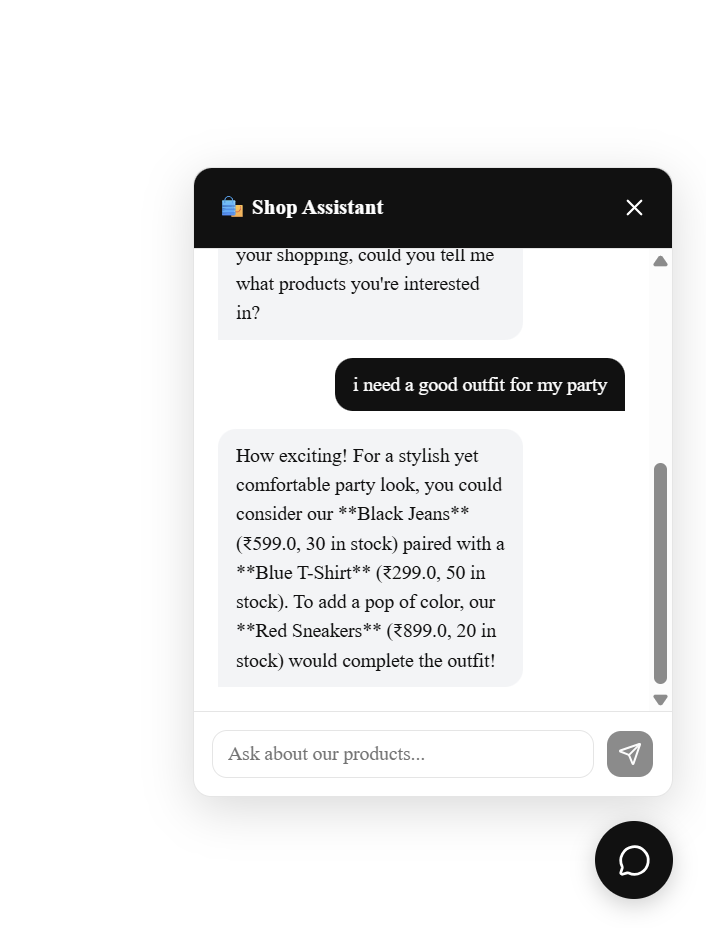
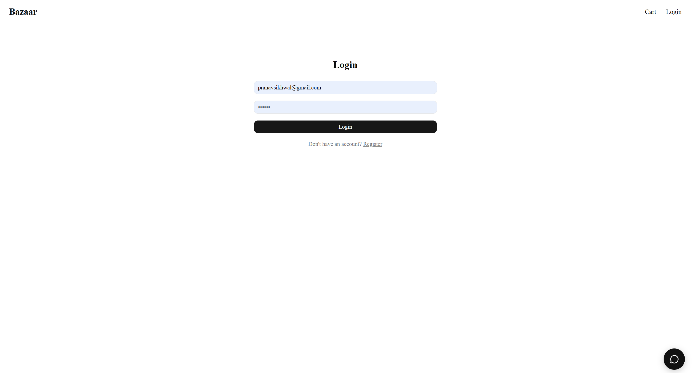
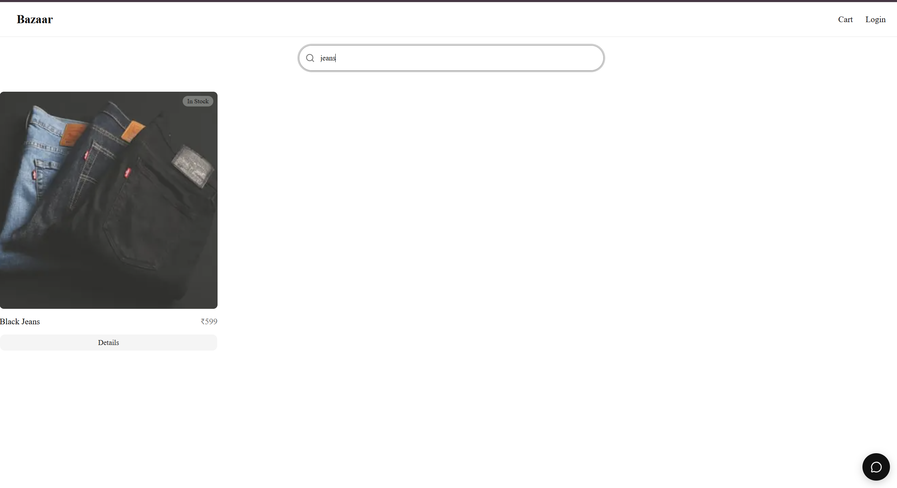
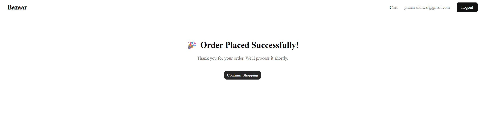

# Bazaar— Full Stack Ecommerce App

A full stack ecommerce web application built with Next.js and FastAPI, featuring JWT authentication, cart management, order placement, AI shopping assistant, and automated tests.

🌐 **Live Demo:** [https://e-com-pranav19.vercel.app/](https://e-com-pranav19.vercel.app)

---

## Screenshots

### Home Page



### Product Detail


### Cart



### Assistant



### Login Page



### Search page



### Order placed



---

## Features

- Product catalog with search and pagination
- Product detail pages with stock status
- JWT authentication — register and login
- Protected cart — add, remove, view items
- Place orders with confirmation
- AI Shopping Assistant powered by Gemini API
- Navbar shows logged-in user with logout
- Pytest test suite — 18 automated tests
- Deployed on Vercel (frontend) and Render (backend)

---

## Tech Stack

| Layer      | Technology                          |
| ---------- | ----------------------------------- |
| Frontend   | Next.js 16, Tailwind CSS, shadcn/ui |
| Backend    | FastAPI, Python                     |
| Database   | PostgreSQL (Render), SQLite (local) |
| ORM        | SQLAlchemy                          |
| Auth       | JWT tokens, bcrypt password hashing |
| AI         | Google Gemini API                   |
| Testing    | Pytest, httpx                       |
| Deployment | Vercel, Render                      |

---

## Getting Started Locally

### Prerequisites

- Python 3.10+
- Node.js 18+
- Git

### Backend Setup

```bash
cd backend
python -m venv venv
venv\Scripts\activate        # Windows
source venv/bin/activate     # Mac/Linux
pip install -r requirements.txt
```

Create a `.env` file in the `backend/` folder:

```
SECRET_KEY=your-secret-key
ALGORITHM=HS256
ACCESS_TOKEN_EXPIRE_MINUTES=30
DATABASE_URL=sqlite:///./shop.db
GEMINI_API_KEY=your-gemini-key
```

Run the server:

```bash
uvicorn main:app --reload
```

Seed the database with test products:

```bash
python seed.py
```

### Frontend Setup

```bash
cd frontend
npm install
```

Create a `.env.local` file in the `frontend/` folder:

```
NEXT_PUBLIC_API_URL=http://localhost:8000
```

Run the dev server:

```bash
npm run dev
```

Open [http://localhost:3000](http://localhost:3000)

---

## API Endpoints

### Products

```
GET  /products/              → list all products (search, pagination)
GET  /products/{id}          → single product
```

### Auth

```
POST /auth/register          → create account
POST /auth/login             → login, returns JWT token
```

### Cart (requires token)

```
GET    /cart/                → get my cart
POST   /cart/add             → add item to cart
DELETE /cart/{item_id}       → remove item
```

### Orders (requires token)

```
POST /orders/place           → place order, clears cart
GET  /orders/my              → my order history
```

### AI

```
POST /ai/chat                → chat with shopping assistant
```

---

## Running Tests

```bash
cd backend
pytest test/ -v
```

Expected output:

```
test/test_products.py::test_get_all_products PASSED
test/test_products.py::test_search_products PASSED
test/test_products.py::test_search_no_results PASSED
test/test_products.py::test_get_single_product PASSED
test/test_products.py::test_get_product_not_found PASSED
test/test_products.py::test_pagination PASSED
test/test_auth.py::test_register PASSED
test/test_auth.py::test_register_duplicate_email PASSED
test/test_auth.py::test_login_success PASSED
test/test_auth.py::test_login_wrong_password PASSED
test/test_auth.py::test_login_wrong_email PASSED
test/test_auth.py::test_token_is_string PASSED
test/test_cart.py::test_get_cart_no_token PASSED
test/test_cart.py::test_add_to_cart_no_token PASSED
test/test_cart.py::test_get_cart_with_token PASSED
test/test_cart.py::test_add_to_cart PASSED
test/test_cart.py::test_cart_has_item_after_adding PASSED
test/test_cart.py::test_remove_from_cart PASSED

18 passed
```

---

## Project Structure

```
ecom-project/
├── backend/
│   ├── routers/
│   │   ├── products.py
│   │   ├── auth.py
│   │   ├── cart.py
│   │   ├── orders.py
│   │   └── ai.py
│   ├── test/
│   │   ├── conftest.py
│   │   ├── test_products.py
│   │   ├── test_auth.py
│   │   └── test_cart.py
│   ├── main.py
│   ├── models.py
│   ├── schemas.py
│   ├── database.py
│   └── requirements.txt
└── frontend/
    ├── app/
    │   ├── page.tsx
    │   ├── layout.tsx
    │   ├── cart/
    │   ├── login/
    │   └── products/[id]/
    ├── components/
    │   ├── navbar.jsx
    │   ├── product-cards-03.tsx.jsx
    │   ├── AddToCartButton.jsx
    │   └── Chat_widget.jsx
    |   └── ui/
    |      └── badge.tsx
    |      └── button.tsx
    |      └── input.tsx
    └── lib/
        └── api.js
```

---

## Author

Pranav Sikhwal — [GitHub](https://github.com/pranavsikhwal)
